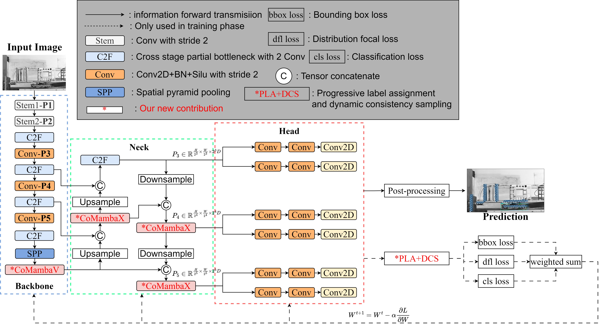
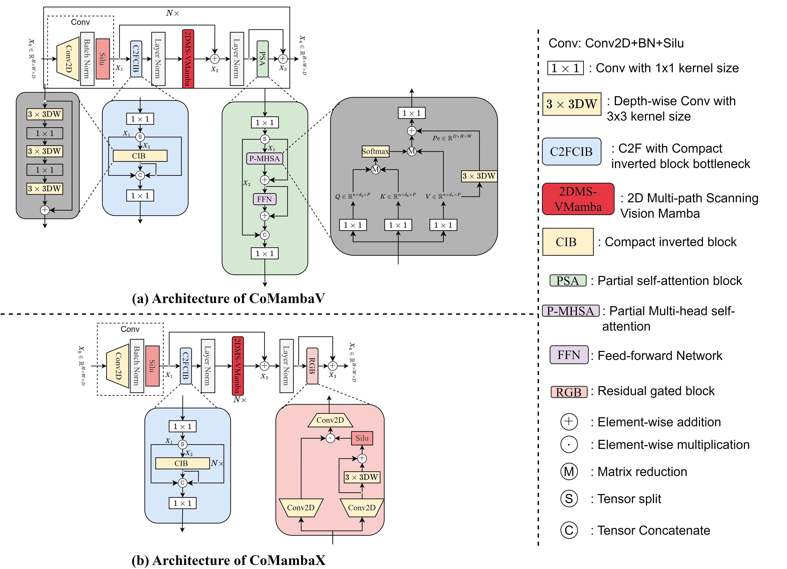

# MSCMR-Pytorch-Implementation
A Multi-path Scanning Collaborative Mamba Framework with Receptive Field Prior Assignment

# Contents
- [Preliminary🔧](##Preliminary)
- [How to start💻](##Start)
- [Results☀️](##Results)
- [Acknowledgements👍](#Acknowledgements)
- [License](#License)


## Preliminary🔧

### Requirments
Causal CNN[](https://github.com/Dao-AILab/causal-conv1d/releases)  
Selective State Space Model (S6)[](https://github.com/state-spaces/mamba/releases)  
`
Cuda version must be aligen with python&pytorch. 
` We can get more detials from this [Web](https://github.com/state-spaces/mamba/issues/97)


### Pretrained 
The pretrianed `pt` weights can be obtained in the [Ultralytics](https://docs.ultralytics.com/zh/models/yolov8/#overview), and put them into the `pretrained` root.  
The datasets [COCO](https://cocodataset.org/) and homemade [Crash2024](https://drive.google.com/drive/folders/1BJOdywj-hgXRKt_q0TEcBGpCV4Wojmhc?usp=drive_link). Putting them into the `datasets` root.  
`COCO-like as JSON type is suggested`

### Download
```
#download our code
git clone https://github.com/YanJieWen/MSCMR-Pytorch-Implementation.git
#into the repository
cd MSCMR-Pytorch-Implementation
#change version (can be ignored)
git checkout tags/XXX
#It is recommended to run the code in edit mode
pip install -v -e .
```

## How to start💻

### Changes
Our code is built on [Ultralytics](https://github.com/ultralytics/ultralytics).
The extral changes are:  

[CoMamba block](https://github.com/YanJieWen/MSCMR-Pytorch-Implementation/tree/master/ultralytics/nn/comamba)  

[PLA assigment](https://github.com/YanJieWen/MSCMR-Pytorch-Implementation/blob/master/ultralytics/utils/tal.py)  

[KL divergence cost](https://github.com/YanJieWen/MSCMR-Pytorch-Implementation/blob/master/ultralytics/utils/metrics.py)  

[Visual tools](https://github.com/YanJieWen/MSCMR-Pytorch-Implementation/tree/master/tools)

### Overall Framework
MSCMR are built based on [cfg](https://github.com/YanJieWen/MSCMR-Pytorch-Implementation/tree/master/ultralytics/cfg/models/comambayolo).  


Our key contribution is 2DVmamba:



### Training
Our MSCMR is follow [YOLOv8](https://github.com/ultralytics/ultralytics), there are 2 version supported: `Nano` and `Small`.  
Taking `Small` version as example：
1) change [tal.py](https://github.com/YanJieWen/MSCMR-Pytorch-Implementation/blob/master/ultralytics/utils/tal.py) -->``line 369`` aligen the model version

2) change [datasets cfg](https://github.com/YanJieWen/MSCMR-Pytorch-Implementation/tree/master/ultralytics/cfg/datasets)

3) ``model=YOLO(./ultralytics/cfg/models/comambayolo/comamba-s.yaml)``

4) ``model.train(data='./ultralytics/cfg/datasets/crash2024.yaml',batch=16,epochs=24,device=[0],lr0=0.01,pretrained='./pretrained/yolov8s-cls.pt')``


### Inference


## Results☀️


## Acknowledgements👍


## License
